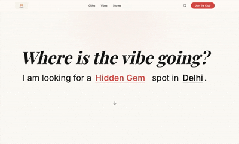

# Maahol 🇮🇳

**Vibe-First Discovery for India.**

Maahol is a curated discovery engine that helps you find the perfect spot based on your mood, not just cuisine or location. Whether you're looking for a quiet "Work Cafe" in Bandra or a high-energy "Date Night" in Mumbai, Maahol guides you to India's best-kept secrets.



## ✨ Features

*   **Mood-First Search**: "Mad Libs" style interactive search to find spots based on intent (e.g., "Date Night in Mumbai").
*   **Dynamic Curations**: Trending sections that update based on your selected city.
*   **Vibe Discovery**: Explore venues by "Sound Profile" (Low-fi, Jazz) or "Lighting" (Dim, Natural).
*   **Inner Circle**: Exclusive newsletter for curated weekend guides and off-the-map launches.
*   **Editorial Design**: High-contrast, typography-forward aesthetic using *Playfair Display* and *Inter*.

## 🛠️ Tech Stack

*   **Framework**: [Next.js 15](https://nextjs.org/) (App Router)
*   **Styling**: [Tailwind CSS v4](https://tailwindcss.com/)
*   **Language**: TypeScript
*   **Icons**: Lucide React
*   **Animation**: Typewriter Effect

## 🚀 Getting Started

1.  Clone the repository:
    ```bash
    git clone https://github.com/yourusername/maahol-web.git
    ```

2.  Install dependencies:
    ```bash
    npm install
    ```

3.  Run the development server:
    ```bash
    npm run dev
    ```

Open [http://localhost:3000](http://localhost:3000) with your browser to see the result.

## 📄 License

This project is licensed under the MIT License - see the [LICENSE](LICENSE) file for details.
